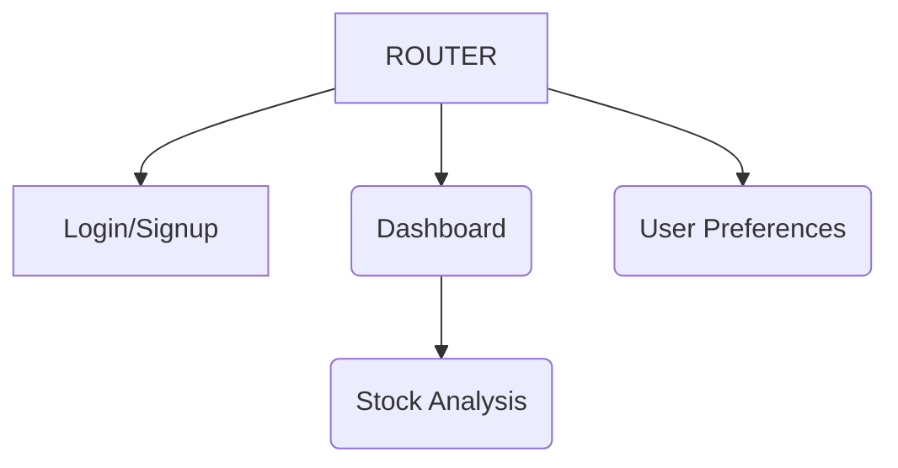

## Information Architecture

### Features
From [requirements gathering](./01_REQUIREMENTS.md), we've specified that the application needs to have the following features:
- Real-time visualization of stock market trend
    - Candlestick Charts, Line Graphs, Comparative Analysis Tool
- Filters
    - Selecting stocks
    - Time Frames
    - Financial Indicators
- User Preferences
    - Favorite Stocks
    - Custom Dashboard Setups

### Architecture
Thus, a list of the pages and their contents might look like:
- Authentication
    - Signup/Login

- Stock Dashboard
    - Display Overview of Favorite Stocks
    - Display List of Favorite Stocks
    - [action] Search for Stocks
    - [action] Follow/Favorite Stocks

- Single Stock Analysis
    - Relevant Data on a Stock
    - Dynamic Candlestick Chart
    - Dynamic Line Graph
    - [action] Follow/Favorite

- User Preference/Settings
    - [action] Follow/Favorite Stocks

#### Future Development (out of scope)
- Display News of Favorite Stocks
- "Popular" Stocks Dashboard
- Crypto, ETFs, and other stock data

